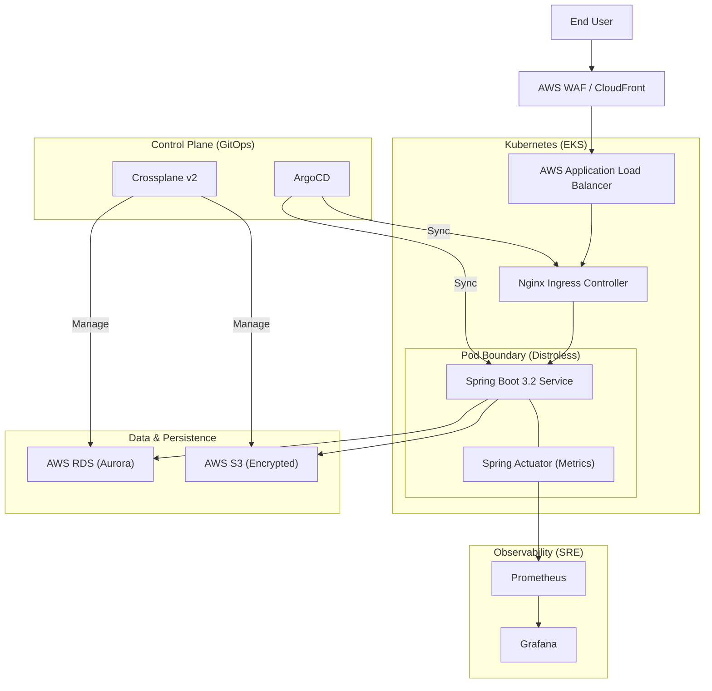

# Cloud Boot Application
[](https://travis-ci.org/rb1whitney/cloud-boot-app)

This is a modernized Java Maven Spring Boot 3.2 application designed for cloud-native deployment. It utilizes Java 21 and features a containerized architecture using Google Distroless for enhanced security and minimal image size.

## 1. Strategic Architecture Overview

The **Cloud-Boot-App** is a high-performance, reference-grade Java backend engineered for secure, scalable orchestration within an AWS-managed Kubernetes ecosystem.



### Modernization Highlights
- **Framework:** Spring Boot 3.2.11
- **Runtime:** Java 21 (Eclipse Temurin)
- **Container:** Google Distroless Java 21 (Debian 12)
- **Architecture:** Clean N-Tier (Controller -> Service -> Repository)
- **Security:** OPA Gatekeeper policies for cluster-level enforcement.
- **Infrastructure:** Multi-layered approach using Terraform and Crossplane v2.
- **Agentic Hub:** Standardized ACS 2026 architecture for cross-IDE compatibility.

## 2. Operational Context & Systemic Constraints

- **Security Posture**: 100% **Distroless** container strategy. Zero shell access, 90% reduction in attack surface.
- **Latency Target**: p99 response time <150ms for authenticated CRUD operations.
- **Data Sovereignty**: Mandatory 100% encryption at rest for all persistence layers (RDS, S3).
- **Policy Compliance**: Zero violations of **OPA Gatekeeper** cluster constraints.

## 3. Playing with the REST Service

### System Endpoints:
```bash
# Hello World
curl http://localhost:8090/cloud-boot-app/

# Version Info
curl http://localhost:8090/cloud-boot-app/version

# Swagger UI
http://localhost:8090/cloud-boot-app/swagger-ui/index.html
```

### CRUD Operations:
```bash
# Create data object
curl -H "Content-Type: application/json" -X POST -d '{ "name" : "Test Data", "description" : "This is a sample description" }' http://localhost:8090/cloud-boot-app/api/v1/data

# Read all data objects
curl -H "Content-Type: application/json" -X GET http://localhost:8090/cloud-boot-app/api/v1/data
```

## 4. Local Quality Checks & Development

Run the following commands before committing to ensure code quality and security:

```bash
# Run all linters AND logic tests (Java, HCL, Helm, Rego Unit Tests)
make lint

# Run infrastructure logic tests & security scans (Checkov)
make test-iac

# Run Java unit tests with coverage
make test-java
```

### Local Development (Devbox & Nix)
```bash
# Enter the dev environment (installs Java, Maven, Terraform, Helm, etc.)
devbox shell

# Run local build
mvn clean package
```

### On-Demand Kubernetes Development (Skaffold)
```bash
# Start dev loop in an on-demand namespace
skaffold dev -n my-dev-namespace
```

## 5. Global CLI Installation
To ensure all project experts can audit the environment, install the following core tools:

| Category | Tool | Installation Command (Linux/macOS) |
| :--- | :--- | :--- |
| **Cloud Core** | AWS CLI | `curl "https://awscli.amazonaws.com/awscli-exe-linux-x86_64.zip" -o "awscliv2.zip" && unzip awscliv2.zip && sudo ./aws/install` |
| **K8s Core** | Kubectl | `curl -LO "https://dl.k8s.io/release/$(curl -L -s https://dl.k8s.io/release/stable.txt)/bin/linux/amd64/kubectl" && chmod +x kubectl && sudo mv kubectl /usr/local/bin/` |
| **GitOps** | ArgoCD | `brew install argocd` |
| **Control Plane** | Crossplane | `brew install crossplane` |
| **Policy Logic** | Gator | `curl -L -o gator https://github.com/open-policy-agent/gatekeeper/releases/download/v3.13.0/gator-v3.13.0-linux-amd64 && chmod +x gator && sudo mv gator /usr/local/bin/` |

## 6. Infrastructure & CI/CD
- **Terraform:** Located in `terraform/` for AWS deployment.
- **Helm:** Located in `helm/cloud-boot-app` for Kubernetes deployments.
- **Crossplane:** v2 Composite Resources for managed infrastructure.
- **Argo CD:** GitOps manifests for automated syncing.
- **Skaffold:** For local Kubernetes development workflow.
- **Devbox:** Nix-powered reproducible dev environment.
- **Gatekeeper:** OPA policies for cluster security.

### GitOps Deployment (Argo CD)
Apply the Argo CD application to sync the entire project via GitOps:

```bash
# Apply the Argo CD Apps
kubectl apply -f argocd/application.yaml
```

### Applying Security Policies (Gatekeeper)
```bash
# Apply Constraint Templates
kubectl apply -f gatekeeper/templates/

# Apply Constraints
kubectl apply -f gatekeeper/constraints/
```

## 7. SRE & Operations
This project adheres to the Agentic SRE Protocol. See `runbooks/` for incident response guides and `terraform/core/sre-monitoring.tf` for the defined Golden Signals.

---
*License: Modified and used from [khoubyari/spring-boot-rest-example](https://github.com/khoubyari/spring-boot-rest-example).*
toring.tf` for the defined Golden Signals.

---
*License: Modified and used from [khoubyari/spring-boot-rest-example](https://github.com/khoubyari/spring-boot-rest-example).*
