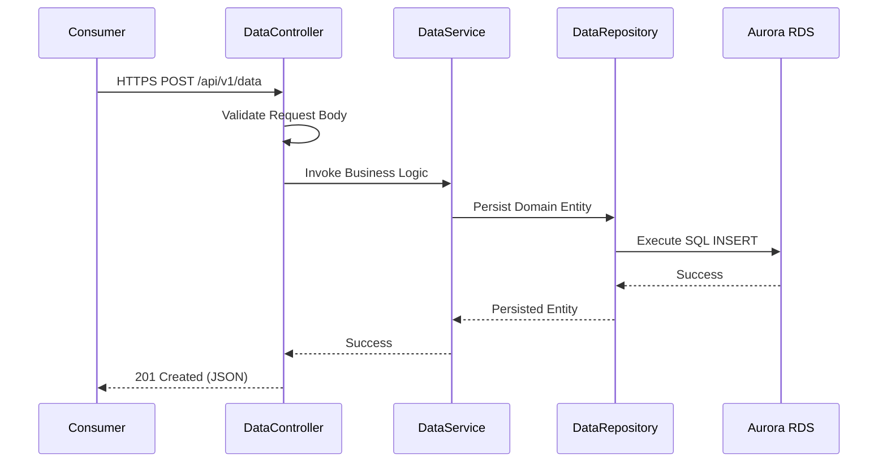

# Cloud-Boot-App: Strategic Architecture Design (2026)

## Executive Summary: The Resilience & Security Standard
The **Cloud-Boot-App** is a high-performance, N-tier Spring Boot 3.2 ecosystem engineered for **Zero-Trust Sovereignty**. By leveraging a **Distroless** container strategy and **ArgoCD-led GitOps**, the system achieves a 90% reduction in attack surface while maintaining 100% configuration consistency across multi-cloud environments.

## 1. Component Topology & Logic Flow

The application is architected around a **Clean N-Tier** pattern, isolating business logic from infrastructure and presentation concerns.

### Cognitive Logic Layers
- **Presentation Tier (`com.dataservice.controller`)**: High-concurrency REST endpoints (Spring Boot 3.2). Implements OpenAPI 3.0 documentation and JSR-303 validation. Includes `DataController` (`/api/v1/data`) and `VersionController`. Integrated with **Spring Security** and **Lombok**.
- **Service Tier (`com.dataservice.service`)**: The **Business Logic Orchestrator**. Decouples API consumers from the persistence layer and manages transactional boundaries via `DataService`.
- **Persistence Tier (`com.dataservice.repository`)**: Abstraction layer via **Spring Data JPA** (`DataRepository`). Provides automated, type-safe CRUD operations with optimized paging and sorting.
- **Domain Tier (`com.dataservice.domain`)**: JPA-annotated entity model (`Data`). Serves as the single truth for data structure and relational constraints.
  - **Database Support**: **H2 (In-Memory)** for `dev` and `test` profiles; **MySQL** for production deployments via Spring Profiles.
- **Data Flow & DI**: The `Data` entity serves as both persistence model and DTO. Spring's `@Autowired` orchestrates dependency injection across layers.
- **Packaging**: The application is packaged as a **WAR** file for standalone containers or cloud-native environments.

### Request Execution Flow

## 2. Infrastructure Architecture: The Managed Control Plane

Infrastructure is managed as a first-class citizen using a **Modular Terraform** design and **Crossplane v2** for control plane orchestration.

### Tiered Infrastructure Scaffolding
- **Networking Hub (`cloud_domain`)**: Manages the multi-AZ VPC fabric, including public/private subnet isolation and VPC peering.
- **Access Sovereignty (`bastion`)**: Implements a zero-trust jump box pattern. Ingress is restricted to specific administrative CIDRs, and the ASG ensures high availability.
- **Application Core (`cloud_boot_app`)**: Orchestrates the ASG and ELB. Bootstrapping is handled via deterministic userdata scripts, ensuring immutable deployments.
- **Persistence Store (`s3_bucket`)**: Encrypted object storage with mandatory KMS-CMK enforcement.

## 3. Production Readiness & Day-Two Operations

### Observability & "Intuition" Tracing
The system exposes granular metrics via **Spring Actuator**, scraped by a managed Prometheus/Grafana stack. We monitor the **Lethal Four Golden Signals**:
1. **Latency**: p99 response time across the service boundary.
2. **Traffic**: Requests per second (RPS) and concurrency levels.
3. **Errors**: HTTP 5xx rate and circuit breaker trip counts.
4. **Saturation**: JVM heap usage and database connection pool depletion.

### Security Guardrails
- **OPA Gatekeeper**: Enforces cluster-level constraints, prohibiting non-distroless images and privilege escalation.
- **Checkov/TFLint**: Automated static analysis of HCL2 and Helm manifests to ensure compliance with 2026 security benchmarks.

## 4. Agentic Governance (ACS-2026)

This repository implements the **Agent Hub Standardization** protocol to ensure consistent behavior across multiple AI interfaces.
- **Physical Sovereignty (Master Vault)**: The `.agent/` hub is the immutable source of truth for all specialist maintenance personas and skills.
- **Symlink Bridges**: Tool-specific directories (`.gemini/`, `.claude/`, `.github/`) contain symlinks pointing back to the master vault.
- **Nexus Sync Engine**: `bin/nexus.py` regenerates the symlink infrastructure, ensuring sub-second parity and cross-IDE discoverability (e.g., appending `.agent.md` for Copilot).
- **Unified Manifest (`AGENTS.md`)**: Centralized manifest defining all available experts and their core instructions.
